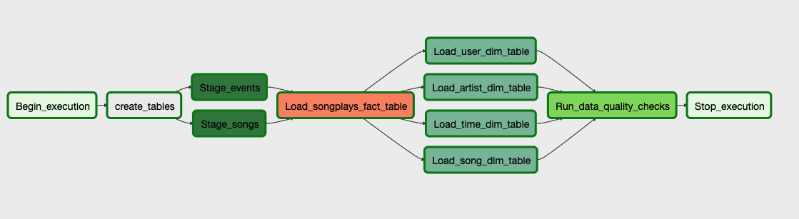

# Airflow-DataPipelines
Udacity Nanodegree - Data Engineering - Airflow Data Pipelines

Automated data pipeline workflows using [Apache Airflow] (https://airflow.apache.org/) to load and process song and log data from Amazon S3 into an [Amazon Redshift] (https://aws.amazon.com/redshift/) for data analytics.

# Introduction

## Background

An analytics team of Startup company, Sparkify, launched their new streaming app and requrires better monitoring and data warehouse system using Apache Airflow.

## Project objective

THe goal is to create custom operators to perform tasks within Apache Airflow platform such that stages, filling, and running checks on data. The is illustrated data flow of the pipeline.

# Custom operators

The project includes operators that is reusable and functional piece to perform each task for the pipeline.

## Stage operator

The stage operators is to load JSON formatted files from S3 to Redshift by running a SQL COPY statement with provided parameters.

## Fact operator

The fact operator is to load data from Stage operator into a fact table utilizing the SQL helper class.

## Dimension operator

The dimension operator is to load data from Fact operator into dimension tables utilizing the SQL helper class with provided table parameter.

## Data quality operator

The data quality operator is to test and check on the data.

# Files and instructions

## Files in this repository

- `dag.py` - DAG (Directed Acyclic Graph) definition script
- `create_tables.sql` - SQL for creating Redshift tables
- `plugins/helpers/sql_queries.py` - SQL for loading data
- `plugins/operators/data_quality.py` - DataQualityOperator class for data quality operator
- `plugins/operators/load_dimension.py` - LoadDimensionOperator class for dimension operator
- `plugins/operators/load_fact.py` - LoadFactOperator class for fact operator
- `plugins/operators/stage_redshift.py` - StageToRedshiftOperator class for stage operator
- `README.md` discusses this project

## Run instructions

1. Create and launch Redshift cluster in AWS
2. Start Airflow web server (running `/opt/airflow/start.sh` on the Udacity environment)
3. Access Airflow server UI and toggle "ON" the DAG named **sparkify_airflow**
